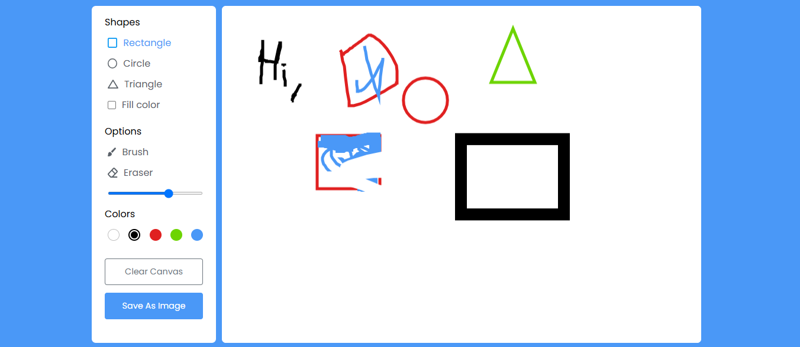

# 🖌️ Drawing App

A simple and interactive drawing web app built with **HTML**, **CSS**, and **JavaScript** that lets users draw shapes, sketch freely, and save their artwork as an image.



🔗 [**Live Demo**](https://anuj0224.github.io/drawingApp/)


## ✨ Features

- 🎨 Draw shapes: Rectangle, Circle, Triangle
- ✏️ Freehand drawing with Brush
- 🧽 Eraser tool
- 🎨 Color picker (White, Black, Red, Green, Blue)
- 📏 Adjustable brush size
- 🧼 Clear canvas button
- 💾 Save your drawing as an image

## 📂 Project Structure

```
drawing-app/
├── index.html        # Main HTML file
├── style.css         # Styling for layout and tools
├── script.js         # App functionality and drawing logic
└── image.png         # Screenshot or preview
```

## 🚀 Getting Started

1. Clone the repository:
   ```bash
   git clone https://github.com/your-username/drawing-app.git
   cd drawing-app
   ```

2. Open `index.html` in your browser:
   ```bash
   open index.html
   ```

   Or simply double-click the file.

## 🛠️ Tech Stack

- HTML5
- CSS3
- JavaScript (Vanilla)

## 📸 Preview

Here's a snapshot of the app in action:


## 📌 Todo / Enhancements (Optional)

- Add shape fill options
- Undo/Redo functionality
- Multi-page canvas
- Mobile responsiveness improvements

## 📃 License

This project is open-source and free to use under the [MIT License](LICENSE).
